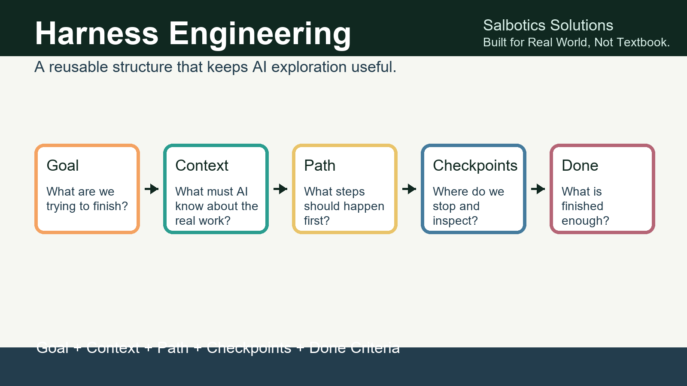

# Salbotics AI Harness Lab

Practical, beginner-friendly materials for turning AI experiments into repeatable workflows.



This repository starts with the talk **Implement Harness Engineering: A Clear Path to Minimize Rabbit Holes While Vibing**. It is built for mixed audiences: never-coders, domain experts, vibe coders, and technical people who want a calmer way to work with AI.

Core idea:

> Vibing is not the problem. Unmanaged vibing is.

Harness engineering means putting a simple reusable structure around AI work:

```text
Goal + Context + Path + Checkpoints + Done Criteria
```

Use the materials here to run a talk, teach a workshop, or improve your own AI workflow.

## Start Here

- Read the [beginner guide](episodes/01-implement-harness-engineering/beginner-guide.md).
- Try the [worksheet](episodes/01-implement-harness-engineering/worksheet.md).
- Browse [Episode 2: Lessons From Real Projects](episodes/02-lessons-from-real-projects/README.md).
- Explore [Episode 3: Programming Language SWOT](episodes/03-programming-language-swot/README.md).
- Copy the [harness prompt template](templates/harness-prompt-template.md).
- Browse the [Episode 1 deck files](episodes/01-implement-harness-engineering/README.md).
- Try the [Lab 02 Ular CP11 playtest tutorial](labs/02-ular-game-design/tutorial-cp11-playtest.md).
- Study the [Lab 03 Underdog Racing tutorials](labs/03-underdog-racing/tutorials/README.md).
- Open the [GitHub Pages site](https://saladiniart.github.io/salbotics-ai-harness-lab/).

## Episode 1

**Implement Harness Engineering** shows how to avoid AI rabbit holes by making your work visible, checkable, and repeatable.

Downloads:

- [PowerPoint deck](episodes/01-implement-harness-engineering/slides/Implement-Harness-Engineering-Salbotics-Watermarked.pptx)
- [PDF deck](episodes/01-implement-harness-engineering/slides/Implement-Harness-Engineering.pdf)
- [Markdown slides](episodes/01-implement-harness-engineering/slides/slides.md)
- [Speaker notes](episodes/01-implement-harness-engineering/speaker-notes.md)

## Episode 2

**Lessons From Real Projects** turns public-safe Salbotics working habits into tutorials for non-technical builders.

Start with:

- [Episode 2 index](episodes/02-lessons-from-real-projects/README.md)
- [Public safety map](episodes/02-lessons-from-real-projects/public-safety-map.md)
- [Tutorial 1: Turn a Vague Idea Into an AI Work Order](episodes/02-lessons-from-real-projects/tutorial-01-ai-work-order.md)
- [Redaction checklist](episodes/02-lessons-from-real-projects/worksheets/redaction-checklist.md)

## Episode 3

**Programming Language SWOT** helps students compare programming languages by
application, student benefit, 5-10 year outlook, and practical tradeoffs.

Start with:

- [Episode 3 index](episodes/03-programming-language-swot/README.md)
- [Full language SWOT report](episodes/03-programming-language-swot/language-swot-report.md)

## Templates

- [Harness prompt template](templates/harness-prompt-template.md)
- [Context pack starter](templates/context-pack-starter.md)
- [Checkpoint rule](templates/checkpoint-rule.md)

## Labs

- [Lab 02: Ular Game Design](labs/02-ular-game-design/README.md) now includes two public-safe prototypes:
  - `cyber-roguelite-prototype`: earlier Python/Pygame checkpoint slice.
  - `ular-retro-engine`: newer Pyxel CP11 roguelite loop with Lab, modules, hazards, boss, rewards, scrap, and developer mode.
- [Lab 03: Underdog Racing](labs/03-underdog-racing/README.md) is a Phaser + TypeScript top-down pixel racing prototype through CP7 and post-CP7 polish, with time-trial physics, Garage upgrades, street-to-pro event gates, driver XP, one-rival AI duel, a Street Underdog Cup championship loop, difficulty selection, visible steering tires, and [tutorials about the lessons learned](labs/03-underdog-racing/tutorials/README.md).

Use Lab 02 and Lab 03 to teach how small game ideas can evolve through harnessed checkpoints without losing source attribution, scope boundaries, playtest notes, handoff docs, or the lessons learned along the way.

## License

Slides, guides, worksheets, and documentation are licensed under [Creative Commons Attribution 4.0 International](LICENSE-CC-BY-4.0.md).

Future demo code is licensed under the [MIT License](LICENSE-MIT.md).

## Salbotics

Salbotics Solutions — Built for Real World, Not Textbook.

This project is a give-back learning hub with a soft Salbotics imprint.
